#### 容器資料型別

- [列表](container/01_列表_定義列表.py)
- [列表操作](container/03_列表_增刪改查.py)
- [元組](container/08_元組.py)
- [字典](container/19_字典_定義字典.py)
- [字典操作](container/20_字典_增刪改查.py)
- [成員運算符](container/23_資料容器_通用操作.py)
  - 最後一個範例
- [序列的切片操作](container/12_序列的切片操作.py)
- [序列的其他操作](container/13_序列的其他操作.py)

#### Function

- [重新認識函式](function/01_重新認識函式.py)
  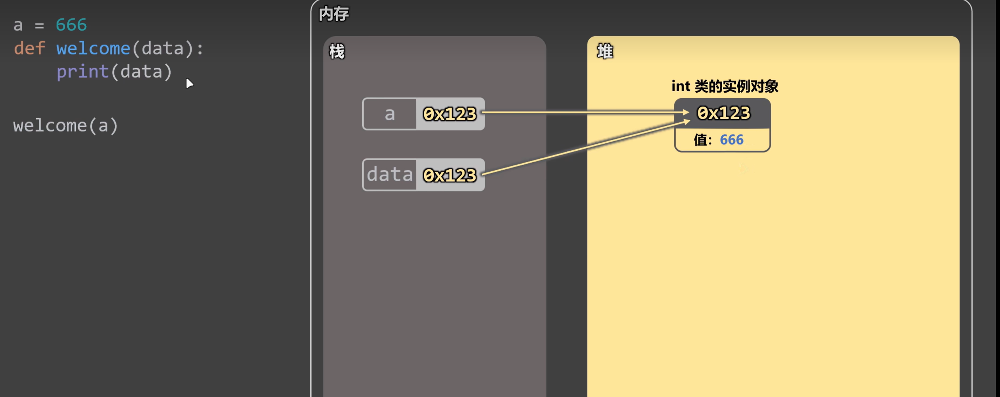
  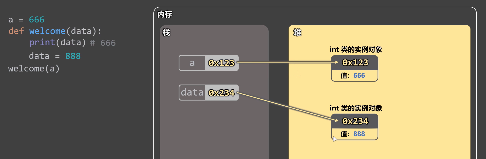
  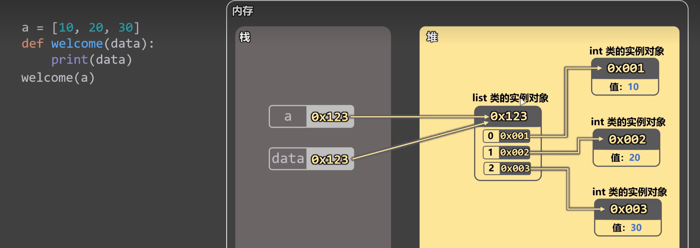
  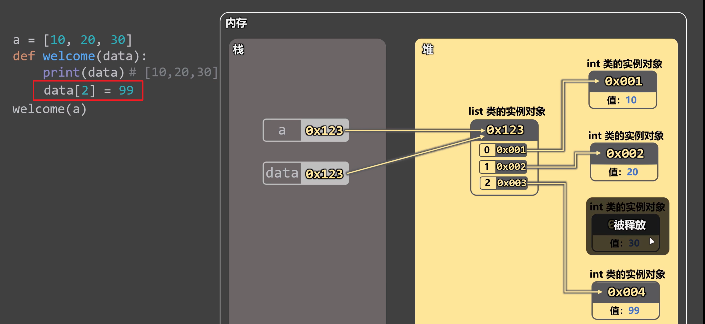
- [多返回值參數的打包與解包](function/02_多返回值_參數的打包與解包.py)
- [高階函式](function/03_高階函式.py)
- [條件表達式](function/04_條件表達式.py)
- [匿名函式](function/05_匿名函式.py)
- [資料處理-map](function/06_資料處理_map函式.py)
- [資料處理-filter](function/07_資料處理_filter函式.py)
- [列表推導式](function/10_列表推導式.py)
- [淺拷貝與深拷貝](function/12_淺拷貝_深拷貝.py)
  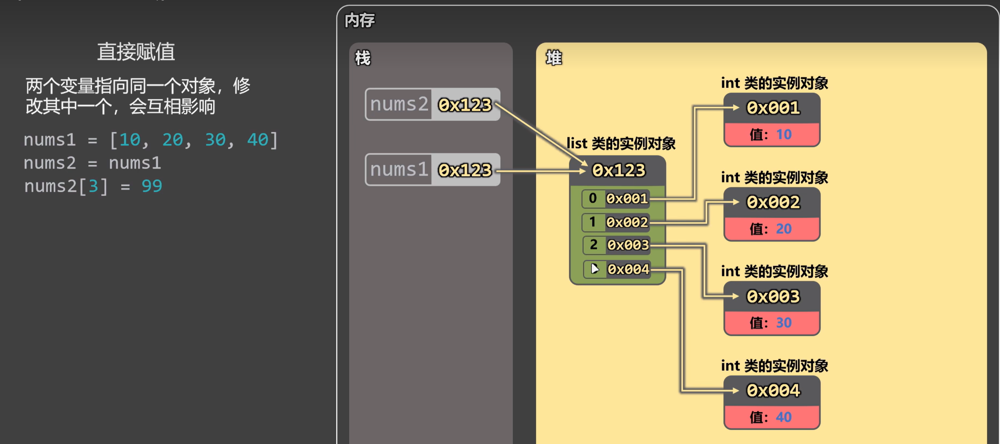
  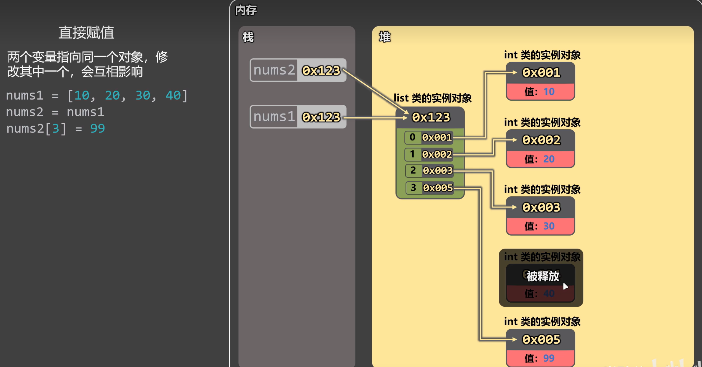
  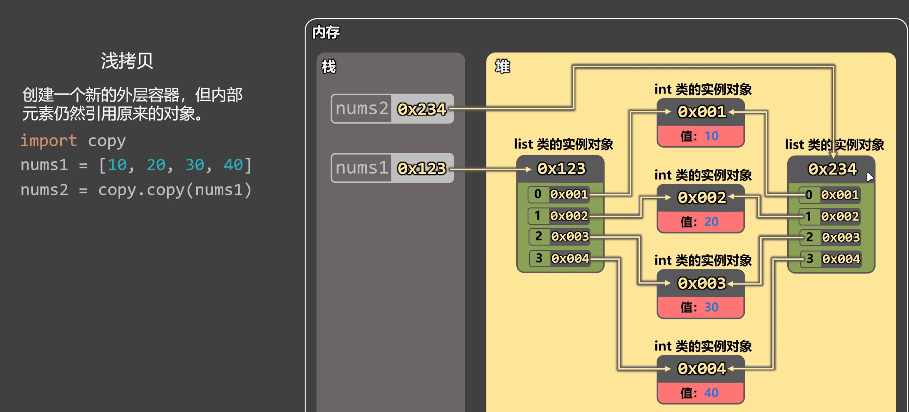
  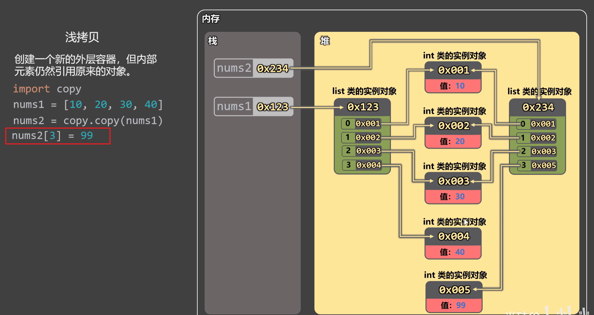
  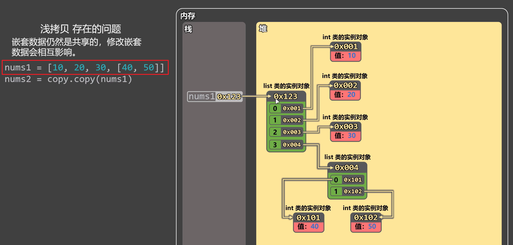
  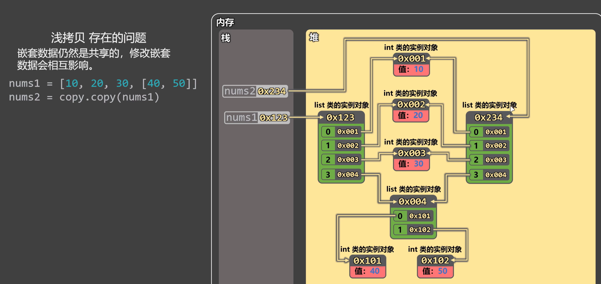
  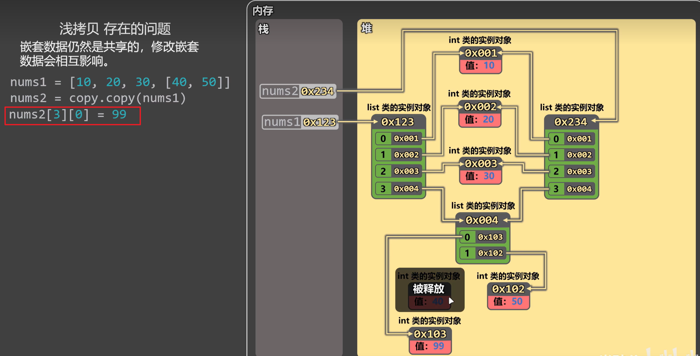
  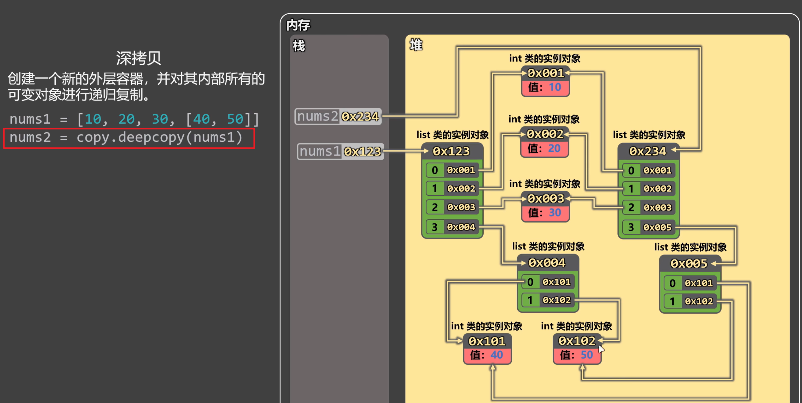
  
- [變數類型註解](function/17_變數類型註解.py)
- [函式類型註解](function/18_函式註解.py)

#### 物件導向

- [類別](object-oriented/01_類別的定義.py)
- [建立物件](object-oriented/02_建立實例.py)
- [實例屬性](object-oriented/04_實例屬性.py)
- [類別屬性](object-oriented/05_類屬性.py)
- [實例方法](object-oriented/06_實例方法.py)
- [類方法](object-oriented/07_類方法.py)
- [靜態方法](object-oriented/08_靜態方法.py)
- [繼承](object-oriented/09_繼承.py)
- [方法重寫](object-oriented/10_方法重寫.py)
- [三種權限](object-oriented/13_三種權限.py)
- [Getter 與 Setter](object-oriented/14_getter與setter.py)
- [魔術方法](object-oriented/15_魔法方法.py)
- [抽象類別](object-oriented/19_抽象類別.py)

#### 迭代器與生成器

- [迭代器](iterator/01_初識迭代器.py)
- [迭代器優勢](iterator/03_迭代器的優勢.py)
- [生成器](generator/01_生成器.py)

#### 非同步

- [coroutine](async/basic/01_coroutine.py)
- [task](async/basic/02_task.py)
- [並行](async/basic/03_task_並行.py)
- [task 進階](async/basic/04_task-adv.py)

#### 模組

- [模組](module/01_模組.py)
- [套件](module/03_包.py)

#### 裝飾器

- [函數裝飾器](decorator/02_函式裝飾器.py)

#### 記憶體分析

- [記憶體分析](memory/01_記憶體分析.py)
  - 不可變對象記憶體分析圖示：
    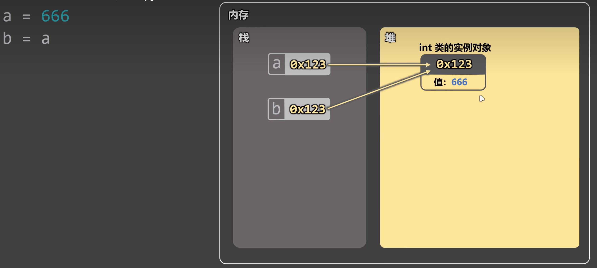
    a=888
    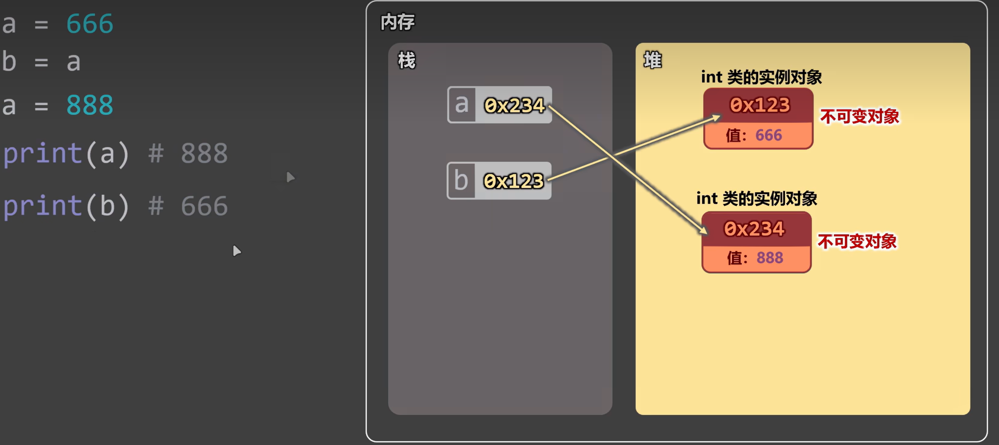
    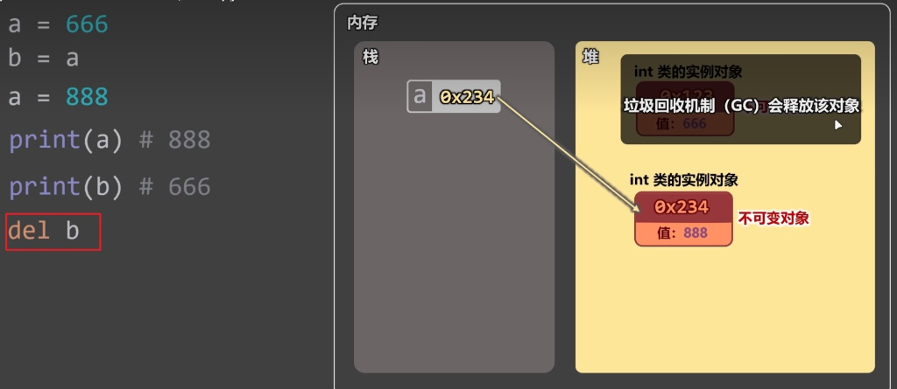
  - 可變對象記憶體分析圖示：
    
    stu_list[0]='阿三'
    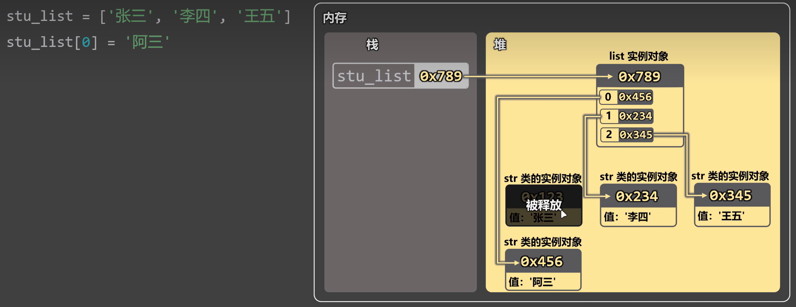
  - 可變對象記憶體分析圖示：
    
    
